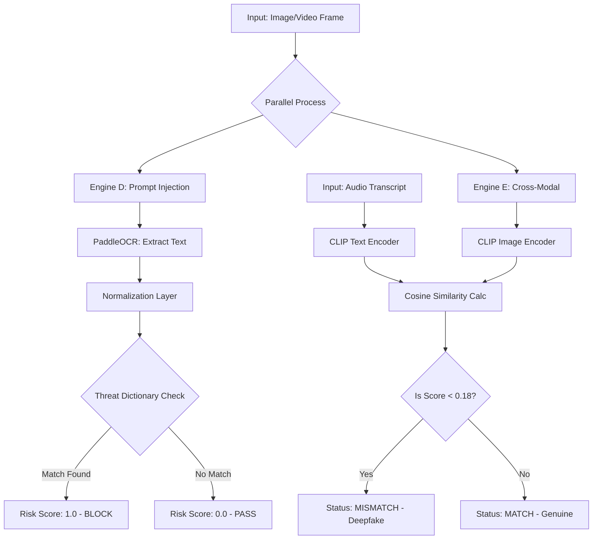

# Multimodal Visual Security Engine (OCR + CLIP)

## System Architecture



**Engine D (Visual Prompt Injection)**  
OCR-based detection. PaddleOCR extracts visible or hidden text (e.g., low-contrast or white-on-white overlays), then a normalization layer de-obfuscates tokens and checks for adversarial commands like "Ignore previous instructions" using a threat dictionary.

**Engine E (Cross-Modal Consistency)**  
Semantic-based (not OCR). CLIP (ViT-B/32) embeds both the video frame and the audio transcript into a shared vector space to verify that the visual context matches the spoken context.

## Quick Start

```bash
# Install dependencies
pip install -r requirements.txt

# Run the Visual Engine Test
python -m src.engines.visual_engine
```
